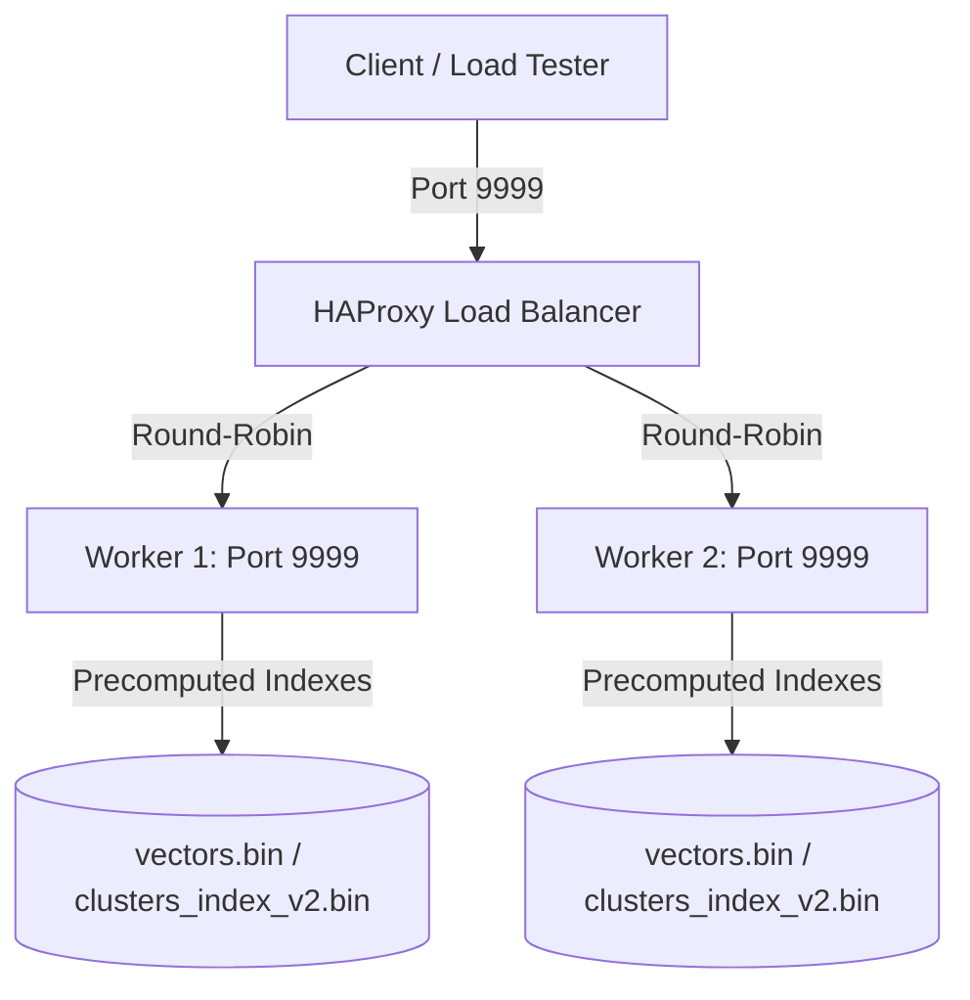

# Rinha de Backend 2026 — Fraud Detection API in C++

A zero-dependency HTTP server written in C++23 that classifies credit card transactions as fraudulent or legitimate in milliseconds. Built for [Rinha de Backend 2026](https://github.com/zanfranceschi/rinha-de-backend-2026), running under a hard cap of 1.0 CPU and 350MB RAM total.

The core idea: given 3,000,000 pre-classified transactions as a reference set, find the 5 nearest neighbors of any incoming transaction in a 14-dimensional feature space and vote on the result. The challenge is doing that search fast enough to matter.



---

## Results
 
**278th place** out of 406 submissions — P99 of 2,739ms at the official run.
 
The KNN search itself is fast. The bottleneck seems to be the server: a single-threaded accept loop means every request waits for the previous one's search to finish before even being read off the socket. Under the competition's load tester, that queuing compounds into timeouts fast. The fix — a thread pool or epoll — is the obvious next step and something we'd do differently in a second attempt.
 
The algorithm holds up. Locally, latency is in the single-digit milliseconds. The pruning works, the binary index loads clean, and the C++ is doing exactly what we designed it to do.
 
---


## How it works

### The competition rules

Each request sends a JSON payload describing a transaction. The server normalizes its 14 features into a vector and finds its 5 nearest neighbors ($K=5$) in the reference dataset.

- If $\ge 3$ of the 5 neighbors are labeled fraud (`f`), the transaction is rejected (`approved: false`).
- The fraud score is the fraud ratio among neighbors: $0.0$ to $1.0$.

### Why brute force doesn't work

Scanning 3,000,000 vectors on every request, under 0.35 CPUs per worker, is a non-starter. We need to skip most of the dataset on each query.

### KMPP-KNN: space partitioning + triangle inequality pruning

During a one-time precomputation phase, we run **K-Means++** to partition the 3M vectors into $M = \lfloor\sqrt{N}\rfloor = 1{,}733$ clusters. Each cluster stores its centroid and a boundary radius (the distance to its furthest member).

At query time:

1. Find the closest cluster centroid to the incoming vector. Scan all of its members to build an initial top-5 candidate list with a current worst distance $D_k$.
2. For every other cluster $j$, compute the distance to its centroid $D_j$.
3. If $(D_j - r_j) \ge D_k$, no point in cluster $j$ can beat the current top-5 — skip the entire cluster.
4. Otherwise, scan cluster $j$'s members and update the candidate list.

In practice this prunes well over 99% of the dataset per query.

**Why K-Means++ over plain K-Means?** The `++` initialization spreads centroids proportionally to $D(x)^2$, which produces more balanced clusters and fewer degenerate edge cases — especially relevant here since poorly placed centroids could make the pruning step nearly useless.

### Custom JSON parser

No external JSON library. The request body is scanned with a single-pass pointer-based parser that extracts fields by jumping between key markers and delimiters directly in the socket buffer. Allocates nothing.

### Binary index precomputation

Parsing the 3.7 GB `references.json` at startup is too slow. On first run, the server parses it once, runs K-Means++, and writes two binary files:

- `vectors.bin` — the full 3M normalized transaction vectors
- `clusters_index_v2.bin` — the precomputed cluster index

Every subsequent boot loads these directly into memory in milliseconds.

---

## Project structure

```
.
├── CMakeLists.txt          # Release build with -O3 -march=native
├── docker-compose.yml      # worker1, worker2, loadbalancer with CPU/RAM caps
├── docker/
│   ├── Dockerfile          # Multi-stage docker build to create minimal runtime image
│   └── HAProxy/
│       └── haproxy.cfg     # Round-robin across both workers
├── include/
│   ├── vector.hpp          # 14-dimensional transaction vector struct + normalization constants
│   ├── cluster.hpp         # Cluster: centroid, radius, size, member indexes
│   ├── kmeanspp.hpp        # K-Means++ interface
│   ├── kmppknn.hpp         # KMPP-KNN query interface
│   └── network.hpp         # Socket constants, buffer sizes, prebuilt HTTP responses
└── src/
    ├── main.cpp            # Entry point: loads indexes, runs socket server
    ├── vector.cpp          # JSON parser, normalization, distance functions
    ├── cluster.cpp         # Cluster membership and centroid distance
    ├── kmeanspp.cpp        # K-Means++ init + convergence loop
    └── kmppknn.cpp         # Search engine: binary insertion, cluster pruning
```

---

## Running it

### Local (development)

**Requirements:** CMake 3.10+, GCC/Clang with C++23 support.

```bash
git clone https://github.com/KGMats/Rinha-de-Backend-2026.git
cd Rinha-de-Backend-2026

mkdir build && cd build
cmake ..
make

./Rinha2026
```

The first run detects missing binary indexes, parses `references.json`, runs clustering (takes a few minutes), and writes `vectors.bin` and `clusters_index_v2.bin` to the build folder. Every run after that boots in milliseconds.

### Docker (recommended for submission)

> **Before building the image**, run the server locally once to generate the binary indexes inside `./build/`. The Dockerfile copies them into the runtime image.

```bash
docker compose up -d --build
```

API available at `http://localhost:9999`.

---

## API

### `GET /ready`

Returns `200 OK` once the server is loaded and ready.

### `POST /fraud-score`

Evaluates a transaction and returns the approval decision with fraud score.

```json
{"approved": false, "fraud_score": 0.6}
```

---

## Authors

- **Kayky Gibran**
- **Matheus Yanetti**
